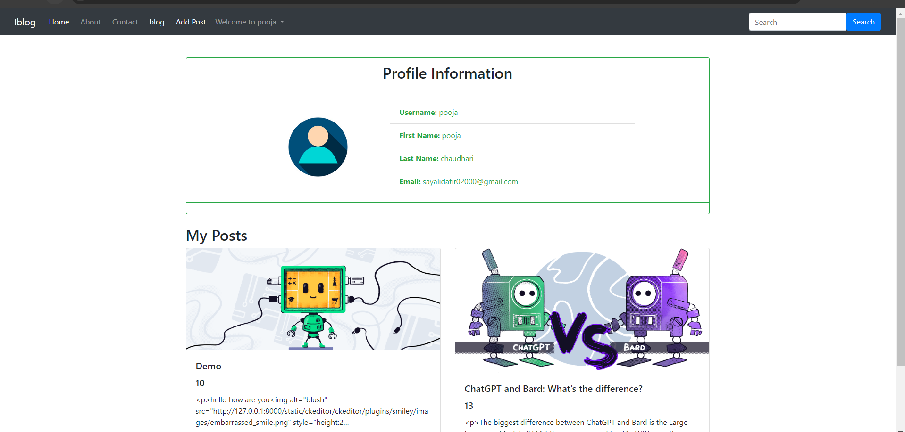
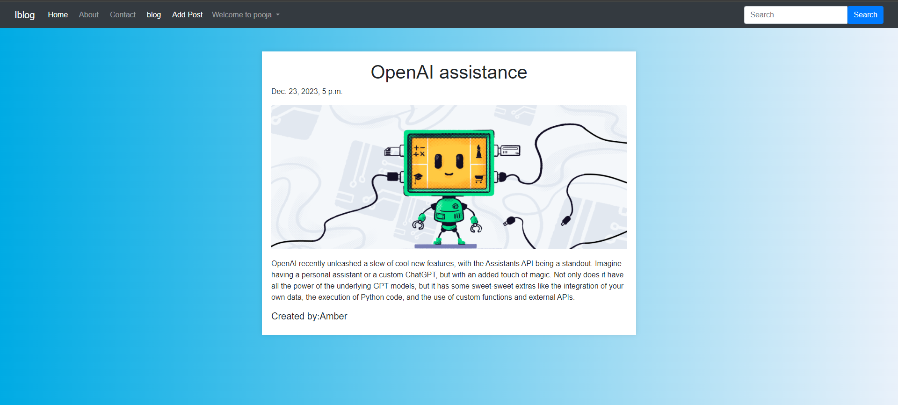

# BlogProject

BlogProject is a Django-based blog website that allows users to view and create blog posts. It features a home page to display all blog posts, along with additional pages such as contact, about, signup, login, user profile, and search functionality.

## Table of Contents

1. [Introduction](#introduction)
2. [Features](#features)
3. [Folder Structure](#folder-structure)
4. [Screenshots](#screenshots)
5. [Getting Started](#getting-started)
6. [Usage](#usage)
7. [Contributing](#contributing)

## Introduction

BlogProject is a full-fledged Django application designed to provide a platform for creating and sharing blog posts. It includes essential features such as user authentication, user profiles, blog creation, search functionality, and various static pages.

## Features

- Home page to display all blog posts.
- Contact page for users to get in touch.
- About page to provide information about the website.
- Signup and login functionality for users.
- User profile section to display user-specific blog posts.
- Read more page to view individual blog posts in detail.
- Search functionality to search for specific blog posts.

## Folder Structure

The folder structure of the BlogProject repository is organized as follows:

- `bloghome/`: Django app containing models, views, templates, and static files related to blog functionality.
- `home/`: include all pages and views for login,signup, addpost etc .
- `templates/`: HTML templates for different pages.
- `media/`: Directory to store user-uploaded media files.
- `newblog/`: Main Django project directory containing settings, URLs, and other configurations.

## Screenshots

Here are the screenshots of different pages in the BlogProject website:

- Home Page:
  


- Contact Page:
  


- About Page:
  


- Signup Page:
  


- Login Page:
  


- User Profile Page:
  


- Read More Page:
  


- Search Results Page:
  

## Getting Started

To get started with BlogProject, follow these steps:

1. Clone this repository to your local machine:

    ```bash
    git clone https://github.com/Datirsayali12/BlogProject.git
    ```

2. Install the required dependencies listed in `requirements.txt`:

    ```bash
    pip install -r requirements.txt
    ```

3. Configure the Django settings for database and other settings as per your requirements.

4. Run the Django development server:

    ```bash
    python manage.py runserver
    ```

5. Access the BlogProject website at `http://127.0.0.1:8000` in your web browser.

## Usage

Once the website is running, users can navigate to different pages, view blog posts, create an account, login, create blog posts, search for specific posts, and view individual posts in detail.

## Contributing

If you find any issues, have suggestions for improvements, or would like to contribute to the development of BlogProject, please feel free to open an issue or submit a pull request.


